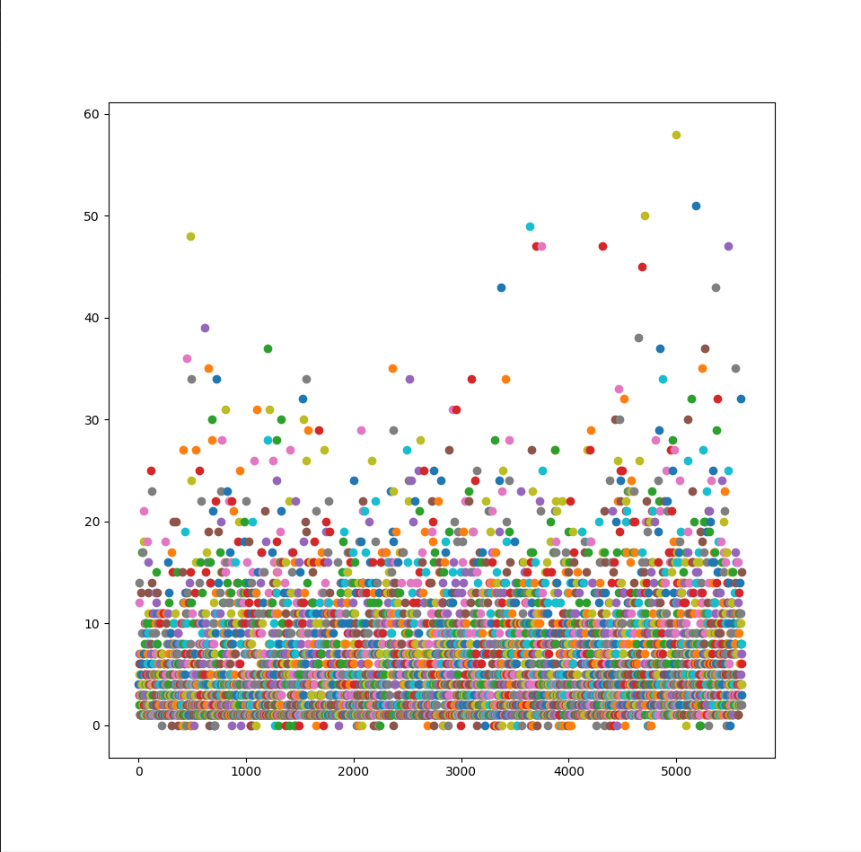

# Flappy-Birds
NN + RL for Flappy Birds
 
 
An agent trained to play Flappy Birds using Q learning and Neural Networks. Our project for the Neural Networks course in 2019. 
The learning environment used is from [PyGame-Learning-Environment](https://pygame-learning-environment.readthedocs.io/en/latest/user/games/flappybird.html).
 
 

 
 
Results of our best agent ( vertical -> score, horizontal -> number of games):
 

 
Two hidden layers, with leaky relu and tanh as activation functions and Adadelta as optimizer.
